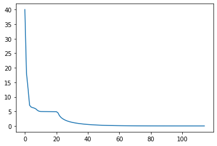
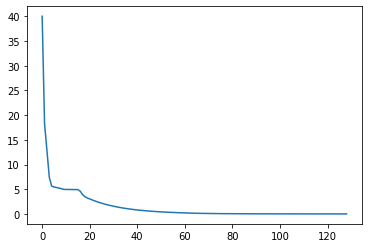
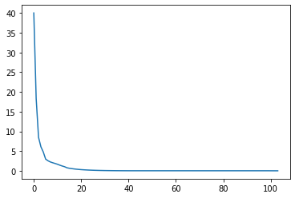
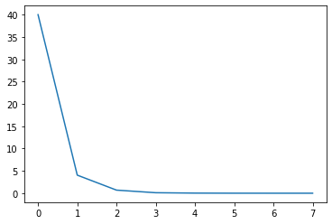

# Report: Assignment 2 Part 2

Team 59
| 2019115008 | Dhruvee Birla |
| -------------- | -------------------- |
| **2019113013** | **Pahulpreet Singh** |

## Task 1

### **The general trends observed when IJ was at a particular state are as follows:**

- Trends by Position:

  - While at the centre position, in the first iteration, we observe IJ initially prefers to `STAY` and `HIT` but gradually he chooses to move to other positions as well.
  - In the east position, the aggressive actions, namely, `SHOOT` and `HIT` are preferred by him
  - In the west position, he `SHOOT`s all the time in the initial iterations, and still `SHOOT`s most of the time in later iterations, except for the case when he has 0 arrows. In cases with higher health or lower material, he prefers to move to the right.
  - While at the south position, it is expected that he would prefer to `GATHER`, but that is not the case. `GATHER` is only preferred in certain cases, that is, when MM is ready. In some states, `GATHER` is preferred during the initial iterations but is changed to `STAY` or `UP` in the later iterations. For the remaining states, `GATHER` remains to be the most optimal action. In the case of MM being dormant, even when IJ has no arrows and no material, `GATHER` is not seen to be the action of choice.
  - In the north position, in case of IJ having less than 3 arrows and non-zero material, `CRAFT` is the most preferred action throughout all the iterations but in the case of IJ having 3 arrows or no material, he prefers to go down.

- Trends by Arrows or Material:

  - IJ prefers to `SHOOT` in case he has 3 arrows and prefers to `HIT` in case of a lower number of arrows.
  - In the final iteration, at positions centre and east, `SHOOT` is not the optimal action in most cases.
  - In the north position, when IJ has 0 or 1 arrow, he prefers to `CRAFT` but in the case he has 2 or 3 arrows, this is not the case.
  - In the south position, the number of arrows have a slight effect on the `GATHER` action. The effect is that in case of a lesser number of arrows, more number of iterations have `GATHER` as the preferred action even when it is not the final choice after convergence.

- Trends by MM’s State:

  - In case MM is dormant, it in general prefers to move to the east in some manner and `HIT`.
  - When it is ready, it prefers to move to the west and `SHOOT` from a safe distance.
  - In the ready state, some states where IJ is waiting for MM to become dormant again, have `STAY` as the preferred choice of action.
  - The utility of actions like `GATHER` and `CRAFT` also increases as they are also in some sense ‘waiting’ actions.

- Trends by MM’s health:

  - In the east position, `HIT` is the preferred aggressive action when MM has higher health and `SHOOT` is the action of choice when it’s health is equal to 25. This is because `SHOOT` has a higher success rate than `HIT` action.
  - With higher health, `CRAFT` and `GATHER` are the actions of choice in the north and south positions, this is not the case in case of lower health.  
    This can be explained by reasoning that `CRAFT` and `GATHER` are helpful in the long term and therefore are preferred but when the remaining health of MM is only 25, an aggressive action is preferred. This is because our model is trained to perform optimal actions and killing MM in case of lower MM health is the optimal choice and in case of higher health, productive actions seem to be the optimal actions.

A few peculiar trends were observed when IJ was at a particular state, the most striking observation was that in the state (W, 2, 3, R, 75) and (S, 0, 0, R, 100) the preferred action is to `STAY` which seems counter-intuitive since the `STAY` action does not seem to be the most optimal action intuitively, because it seems to be a very passive and a waste of ‘time’ (in terms of step cost).

### **Convergence:**

It took a total of 115 iterations for the utilities of all the states to converge.  
Initially the rate of convergence is pretty fast, the trend is 40, 18.3, 12.9, 7.1…, but pretty soon, the rate decreases and the trend is now ... 4.95, 4.94, 4.94, 4.93, 4.93, 4.92….

By the end of, the rate further decreases and the trend is now ... 0.0019, 0.0018, 0.0016, 0.0015, 0.0014, 0.0012, 0.0011, 0.0010…

These values in the trend denote the maximum difference between utilities of a given state, between two consecutive iterations.

These trends seem to portray a pattern similar to exponential decay but with some noise.

The following graph denotes the values in these trends :

### **Simulations:**

#### 1. Start State is (W, 0, 0, D, 100)

| **State**         | **Action** |
| ----------------- | ---------- |
| (W, 0, 0, D, 100) | RIGHT      |
| (C, 0, 0, R, 100) | DOWN       |
| (S, 0, 0, R, 100) | STAY       |
| (S, 0, 0, D, 100) | UP         |
| (C, 0, 0, D, 100) | RIGHT      |
| (E, 0, 0, D, 100) | HIT        |
| (E, 0, 0, D, 50)  | HIT        |
| (E, 0, 0, R, 50)  | HIT        |
| (E, 0, 0, D, 75)  | HIT        |
| (E, 0, 0, D, 75)  | HIT        |
| (E, 0, 0, D, 75)  | HIT        |
| (E, 0, 0, D, 75)  | HIT        |
| (E, 0, 0, D, 25)  | HIT        |
| (E, 0, 0, D, 25)  | HIT        |
| (E, 0, 0, D, 0)   | NONE       |

 

#### 2. Start State is (C, 2, 0, R, 100)

| **State**         | **Action** |
| ----------------- | ---------- |
| (C, 2, 0, R, 100) | UP         |
| (C, 2, 0, D, 100) | RIGHT      |
| (E, 2, 0, D, 100) | HIT        |
| (E, 2, 0, R, 100) | HIT        |
| (E, 2, 0, D, 100) | HIT        |
| (E, 2, 0, D, 50)  | HIT        |
| (E, 2, 0, D, 50)  | HIT        |
| (E, 2, 0, D, 50)  | HIT        |
| (E, 2, 0, D, 50)  | HIT        |
| (E, 2, 0, R, 50)  | HIT        |
| (E, 2, 0, R, 50)  | HIT        |
| (E, 2, 0, D, 75)  | HIT        |
| (E, 2, 0, D, 25)  | HIT        |
| (E, 2, 0, D, 25)  | HIT        |
| (E, 2, 0, D, 25)  | HIT        |
| (E, 2, 0, D, 25)  | HIT        |
| (E, 2, 0, D, 25)  | HIT        |
| (E, 2, 0, R, 0)   | NONE       |

 

## Task 2

## Task 2 Case 1

Indiana now on the `LEFT` action at East Square will go to the West Square.

### **Trends**

The trends observed in this case were almost similar to that of Task 1 since the change of constraints wasn't significant.

The only change observed in the trends is that now when MM gets ready, the preferred action becomes `LEFT` (earlier it was still `HIT`/`SHOOT`). A possible explanation is that IJ wants to run away to a safe square to evade MM's attacks and now it can do it with just one step as opposed to earlier when it had to pass through the center square which is also prone to MM's attacks.

### **Convergence**

It took a total of 129 states for the utilities to converge. The trend observed in this task is similar to the trends observed in task 1 that is, these trends seem to portray a pattern similar to exponential decay, with some noise.

### **Simulations**

#### 1. Start State is (W, 0, 0, D, 100)

| **State**         | **Action** |
| ----------------- | ---------- |
| (W, 0, 0, D, 100) | RIGHT      |
| (C, 0, 0, R, 100) | DOWN       |
| (C, 0, 0, D, 100) | RIGHT      |
| (E, 0, 0, D, 100) | HIT        |
| (E, 0, 0, D, 50)  | HIT        |
| (E, 0, 0, D, 50)  | HIT        |
| (E, 0, 0, D, 50)  | HIT        |
| (E, 0, 0, D, 50)  | HIT        |
| (E, 0, 0, D, 50)  | HIT        |
| (E, 0, 0, D, 50)  | HIT        |
| (E, 0, 0, D, 0)   | NONE       |

 

#### 2. Start State is (C, 2, 0, R, 100)

| **State**         | **Action** |
| ----------------- | ---------- |
| (C, 2, 0, R, 100) | UP         |
| (N, 2, 0, R, 100) | CRAFT      |
| (N, 2, 3, R, 100) | STAY       |
| (N, 2, 3, R, 100) | STAY       |
| (N, 2, 3, D, 100) | DOWN       |
| (C, 2, 3, D, 100) | RIGHT      |
| (E, 2, 3, D, 100) | SHOOT      |
| (E, 2, 2, D, 75)  | SHOOT      |
| (E, 2, 1, D, 50)  | SHOOT      |
| (E, 2, 0, D, 25)  | HIT        |
| (E, 2, 0, R, 25)  | LEFT       |
| (E, 2, 0, R, 25)  | LEFT       |
| (W, 2, 0, R, 25)  | STAY       |
| (W, 2, 0, R, 25)  | STAY       |
| (W, 2, 0, D, 25)  | RIGHT      |
| (C, 2, 0, D, 25)  | UP         |
| (N, 2, 0, D, 25)  | CRAFT      |
| (N, 1, 2, D, 25)  | DOWN       |
| (C, 1, 2, D, 25)  | RIGHT      |
| (E, 1, 2, R, 25)  | SHOOT      |
| (E, 1, 2, R, 0)   | NONE       |

 

## Task 2 Case 2

The step cost of the `STAY` action is now zero.

### **Trends**

Due to the reduced step cost for the `STAY` action, it is preferred much more, especially in the west square.

Except for a few states such as ones with 25 health and non-zero arrows/materials when `RIGHT` or `SHOOT` are the optimal actions, `STAY` is the action of choice for all other states in the west position.

This creates an interesting problem for these states that IJ will be stuck in the west position forever, as every time it will choose `STAY` and since the probability of success is 100%, it can never move to another square. So in the cases when west is the starting square, there will be no change of state other than MM's dormant-ready transitions.

But west is not the only square that is affected. `STAY` becomes the preferred action in north and south squares when MM is ready. When it is dormant, the optimal actions become `DOWN` and `UP` respectively, thus moving to the center square, which is not unexpected.

Surprisingly though, the action of choice for the center squre for all the cases becomes `LEFT`. Even for the east square, `LEFT` is the preferred action for most cases (except when IJ has non-zero arrows and MM has 25 health).

So in the earlier cases, IJ had a tendency to move to the east square and fight MM, but now it has a greater tendency to move to the west square and peacefully remain there for the remaining time because the reward isn't worth the combined step cost of fighting MM.

### **Convergence**

It took a total of 104 states for the utilities to converge. The trend looks much more similar to an exponential decay, with lesser noise than earlier cases.

### **Simulations**

#### 1. Start State is (W, 0, 0, D, 100)

| **State**         | **Action** |
| ----------------- | ---------- |
| (W, 0, 0, D, 100) | STAY       |
| (W, 0, 0, D, 100) | STAY       |
| (W, 0, 0, D, 100) | STAY       |
| (W, 0, 0, D, 100) | STAY       |
| (W, 0, 0, D, 100) | STAY       |
| (W, 0, 0, D, 100) | STAY       |
| (W, 0, 0, D, 100) | STAY       |
| (W, 0, 0, R, 100) | STAY       |
| (W, 0, 0, D, 100) | STAY       |
| (W, 0, 0, D, 100) | STAY       |
| …                 | …          |
| …                 | …          |
| …                 | …          |

This will keep on going forever, as the west square is now an absorbing position, with the reason explained in the Trends subsection.
 

#### 2. Start State is (C, 2, 0, R, 100)

| **State**         | **Action** |
| ----------------- | ---------- |
| (C, 2, 0, R, 100) | LEFT       |
| (W, 2, 0, R, 100) | STAY       |
| (W, 2, 0, D, 100) | STAY       |
| (W, 0, 0, D, 100) | STAY       |
| …                 | …          |
| …                 | …          |
| …                 | …          |

 

## Task 2 Case 3

Change the value of gamma to 0.25

### **Trends**

When MM has high health (75 or 100), IJ prefers to `STAY` in the terminal positions (north, south, west) if he starts off from there. If he has arrows, he will `SHOOT` from the west square. Even from the center square, prefers going into one of these terminal squares. (`LEFT` if he has arrows, `UP`/`DOWN` otherwise.) When he is east, the preferred action is `HIT`, as expected.

In case of low health (25 or 50) when we have (almost) immediate reward, the action of choice from north and south squares becomes `DOWN` and `UP` respectively, in order to reach the center square. From center and east, IJ tries to `SHOOT` if he has arrows and MM has 25 health, otherwise he `HIT`s. Similarly in the west square, he `SHOOT`s if he has arrows, else he prefers to `STAY`.

The general trend of not moving, especially in the cases when MM's health is high, can be explained by the significant change in the discount factor. Since now the step cost plays a much larger role in deciding the utility of a state than utilites of other states, movement us not preferred unless the reward is immediate or the utility of the final state is significantly large.

### **Convergence**

In this case, the utilities converge very fast due to such a significant drop in the discount factor. It takes only 8 iterations for the utilities to converge.

(40, 4.05, 0.69, 0.11, 0.025, 0.006, 0.001, 0.0003)

The rate follows a similar pattern, but it is not very prominent due to the small sample size. Here are the same values visualised in a graphical form:

### **Simulations**

#### 1. Start State is (W, 0, 0, D, 100)

| **State**         | **Action** |
| ----------------- | ---------- |
| (W, 0, 0, D, 100) | STAY       |
| (W, 0, 0, R, 100) | STAY       |
| (W, 0, 0, R, 100) | STAY       |
| (W, 0, 0, D, 100) | STAY       |
| (W, 0, 0, D, 100) | STAY       |
| …                 | …          |
| …                 | …          |
| …                 | …          |

 

#### 2. Start State is (C, 2, 0, R, 100)

| **State**         | **Action** |
| ----------------- | ---------- |
| (C, 2, 0, R, 100) | DOWN       |
| (C, 2, 0, D, 100) | DOWN       |
| (E, 2, 0, D, 100) | HIT        |
| (E, 2, 0, D, 50)  | HIT        |
| (E, 2, 0, R, 50)  | HIT        |
| (E, 2, 0, R, 50)  | HIT        |
| (E, 2, 0, R, 0)   | NONE       |
